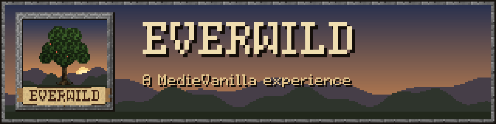
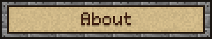
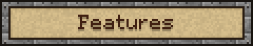
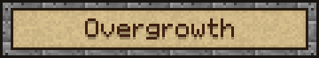
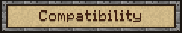
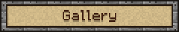
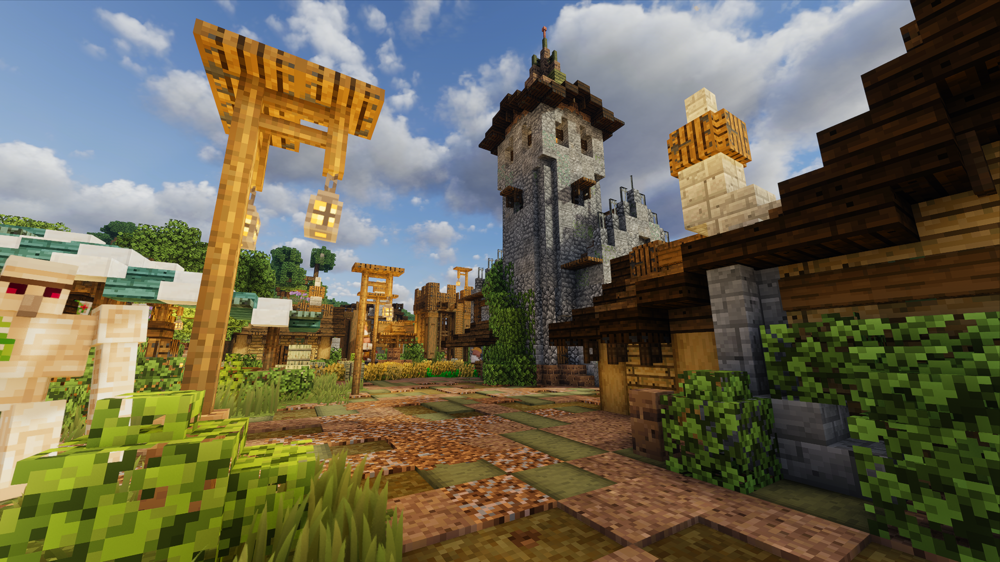
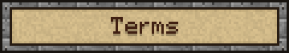

  

  <b>Minecraft looking like Minecraft with a medieval touch.</b> 
  <i>Crafted by Hardek</i>

  
  
  

  <a href="https://modrinth.com/resourcepack/everwild"><b>Modrinth</b></a> ·
  <a href="https://www.curseforge.com/minecraft/texture-packs/everwild"><b>CurseForge</b></a> ·
  <a href="../../releases"><b>Download</b></a>

Everwild keeps Minecraft looking like Minecraft, with a medieval touch.
Stone looks weathered, wood looks worked by hand, and every village feels a little more lived in —
without ever losing the vanilla spirit.

- **Medieval details, vanilla soul** : plank doors with forged iron hinges, leaded glass, iron-banded chests, wrought-iron grilles.
- **No copy-paste worlds** : most blocks come in several random variants, so walls and landscapes never repeat.
- **Lived-in villages** : soot-stained furnaces, worn crafting tables, rusty barrels, sun-faded wool, furrowed farmland.
- **A medieval font** : original, inspired by old manuscripts, still easy to read.
- **Stays familiar** : the UI, HUD and mobs remain vanilla.

*Spice your world with natural details.* Included in Everwild.

| | |
|---|---|
| 🌳 **Trees** | moss and lichen, broken branches, shelf fungus, resin, bird nests, hanging fruit |
| 💧 **Water** | thick cattails, flowering lily pads, algae, icicles |
| 🪨 **Ground & caves** | roots, shells, pale mushrooms |
| 🏰 **Builds** | loose stones in brick walls, wrought-iron sconces, sacks on barrels |

> A standalone version of Overgrowth is coming soon.

| Version | Forge / NeoForge | Fabric / Vanilla |
|---|:---:|:---:|
| 1.20.1 | ✅ | ✅ |
| 1.20.2 – 1.21.11 | ✅ | ✅ ¹ |
| 26.1 – 26.3 | ✅ | ✅ |

¹ A few see-through Overgrowth details on solid blocks aren't shown on these versions.

**Installation:** drop the `.zip` into your `resourcepacks` folder and enable it in *Options → Resource Packs*.

- ✅ Play with it, share it, make videos and screenshots with it.
- ✅ Use it in modpacks, simply just link back to the official page please! 
- ❌ Don't reupload the pack or its textures elsewhere.
- ❌ Don't claim the textures as your own.

See [LICENSE.md](LICENSE.md) for details.

© 2026 Hardek. This is NOT an official Minecraft product. Not approved by or associated with Mojang or Microsoft.

